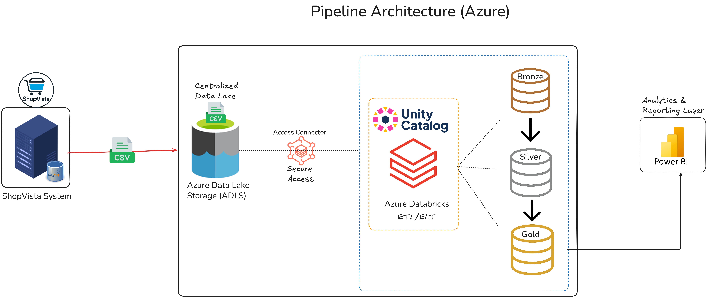
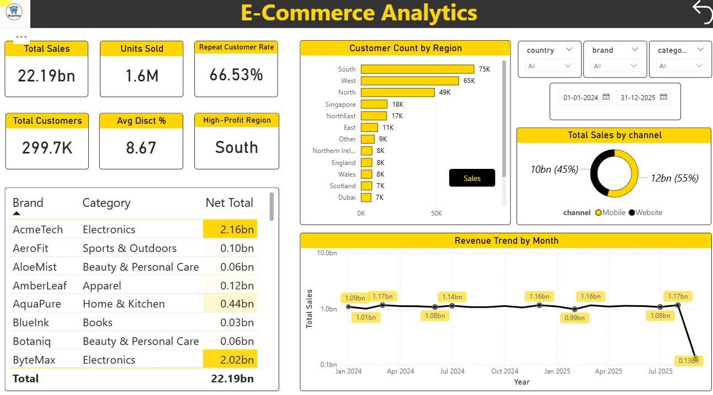

# 🛒 ShopVista E-Commerce Data Pipeline - Azure End-to-End

## 📌 Project Overview

An end-to-end data engineering pipeline built on Azure, processing raw e-commerce transactional data from the ShopVista OLTP system into analytics-ready Gold layer tables using the Medallion Architecture (Bronze → Silver → Gold).

The pipeline handles:
- Historical full loads (Jan 2024 – Aug 2025)
- Daily incremental ingestion (Aug 2025 – Dec 2025)

Governance and metadata management are implemented using Unity Catalog.

---

## 🏗️ Architecture

```text
ShopVista (OLTP)
      │
      ▼ CSV
Azure Data Lake Storage (ADLS)
      │
      ▼ Access Connector (Secure Access)
Azure Databricks + Unity Catalog
      │
      ├──▶ Bronze Layer  (Raw ingestion — Delta tables)
      ├──▶ Silver Layer  (Cleaned & validated — Delta tables)
      └──▶ Gold Layer    (Business-ready aggregations — Delta tables)
                │
                ▼
           Power BI (Analytics & Reporting)
```

### Full Architecture Diagram



---

## 📦 Tech Stack

| Layer | Technology | Purpose |
| --- | --- | --- |
| **Cloud Storage** | Azure Data Lake Storage Gen2 (ADLS) | Scalable cloud-based data storage |
| **Processing** | Azure Databricks (PySpark, SQL) | Distributed ETL and big data processing |
| **Streaming Ingestion** | Auto Loader (`cloudFiles`) + Structured Streaming | Incremental and real-time data ingestion |
| **Table Format** | Delta Lake | ACID transactions, Time Travel, and Change Data Feed (CDF) |
| **Governance** | Unity Catalog | Centralized governance using Catalog → Schema → Tables |
| **Orchestration** | Databricks Jobs & Pipelines | Scheduled daily workflow execution and refresh |
| **Reporting** | Power BI | Interactive dashboards and business reporting |
| **Languages** | Python (PySpark), SQL | Data engineering and transformation logic |

---

## 📂 Data Model

### Source Tables (ShopVista)

#### Dimension Tables (historical full load)
- brands
- category
- products
- customers
- date

#### Fact Tables (incremental daily load from Aug 2025)
- order_items
- order_returns
- order_shipments

### Medallion Layers

```text
ecommerce (catalog)
├── raw
│   └── External volume pointing to ADLS raw landing zone
├── bronze
│   ├── brz_brands
│   ├── brz_categories
│   ├── brz_products
│   ├── brz_customers
│   └── brz_order_items
├── silver
│   ├── slv_brands
│   ├── slv_category
│   ├── slv_products
│   ├── slv_customers
│   └── slv_order_items
└── gold
    ├── gld_dim_products
    ├── gld_dim_customers
    ├── gld_fact_order_items
    └── gld_fact_daily_orders_summary
```

---

## 🔄 Pipeline Details

### 1. Bronze Layer — Raw Ingestion

Dimension tables are ingested from raw CSV files stored in ADLS into Delta tables with:

- Defined PySpark schema per table
- Metadata columns:
  - `_source_file`
  - `ingested_at`
- Write mode: overwrite with schema merge

Fact tables are ingested using Auto Loader (Structured Streaming):

- `cloudFiles` format for incremental file detection
- Schema inference and evolution enabled
- `_rescued_data` column captures unexpected schema changes safely
- Checkpointing for fault tolerance and exactly-once processing
- Append mode into `ecommerce.bronze.brz_order_items`

---

### 2. Silver Layer — Cleansing & Transformation

#### Dimension Cleansing

- Trimming whitespace from string columns
- Removing special characters from identifier fields
- Standardizing inconsistent category codes
- Deduplication using `groupBy()` + `dropDuplicates()`

#### Fact Cleansing (`order_items`)

- Converting text numerics (e.g., `"Two"` → `2`)
- Stripping `$` and `%` symbols
- Normalizing `coupon_code`
- Standardizing channel values
- Adding `processed_time` for tracking

#### Incremental Upsert Strategy

- Delta Lake `MERGE` on composite key (`order_id`, `item_seq`)
- Change Data Feed (CDF) enabled
- Structured Streaming + `foreachBatch`
- Checkpointing for recovery

---

### 3. Gold Layer — Business-Ready Tables

#### Dimension Enrichment

##### `gld_dim_products`
- Joined product + brand + category
- `COALESCE` for null handling

##### `gld_dim_customers`
- Country–state–region mapping
- Derived region attribute

#### Fact Aggregation

Derived metrics:

- `gross_amount = quantity × unit_price`
- `discount_amount`
- `net_amount`
- `coupon_flag`

#### Daily Summary Table (`gld_fact_daily_orders_summary`)

- Aggregates:
  - total quantity
  - gross amount
  - discount
  - tax
  - net sales
- Incremental refresh using last N days
- Delta `MERGE` upsert
- Auto clustering for query optimization

---

## ⚙️ Orchestration

| Job | Trigger | Notebooks | Purpose |
| --- | --- | --- | --- |
| **daily_refresh_dim** | Scheduled daily | Dimension Bronze → Silver → Gold | Refresh dimension tables through the medallion architecture |
| **daily_refresh_fact** | Scheduled daily | Fact Bronze → Silver → Gold | Refresh fact tables through the medallion architecture |
| **daily_refresh_all** | Scheduled daily | Combined dim + fact pipeline | Execute complete end-to-end pipeline refresh |

---

## 🔐 Governance (Unity Catalog)

- Access Connector configured for secure ADLS access
- External Location configured for raw data volume
- Catalog → Schema → Tables structure enforced
- Centralized access control and metadata management

---

## 🗂️ Repository Structure

```text
├── notebooks/
│   ├── bronze/
│   │   ├── ingest_dim_bronze.ipynb
│   │   └── ingest_fact_bronze.ipynb
│   ├── silver/
│   │   ├── dim_bronze_to_silver.ipynb
│   │   └── fact_bronze_to_silver.ipynb
│   └── gold/
│       ├── dim_silver_to_gold.ipynb
│       ├── fact_silver_to_gold.ipynb
│       └── daily_summary.ipynb
├── setup/
│   └── unity_catalog_setup.sql
├── project_architecture.png
├── ecommerce_analytics_report.jpg
└── README.md
```

---

## 💡 Key Design Decisions

| Decision | Reason |
| --- | --- |
| **Auto Loader for fact ingestion** | Scalable incremental file detection without manual tracking |
| **Delta Lake for all layers** | ACID compliance, time travel, and schema evolution support |
| **Change Data Feed on Silver/Gold** | Enables efficient incremental downstream processing |
| **`foreachBatch` + `MERGE` pattern** | Handles late-arriving data and upserts reliably |
| **Unity Catalog governance** | Centralized access control and metadata management across all layers |
| **Daily summary pre-aggregation** | Reduces query load on Power BI and improves dashboard performance |

---

## 📊 Power BI Integration

Gold layer Delta tables are connected to Power BI using the Azure Databricks connector.

Dashboards consume:

- `gld_dim_products`
- `gld_dim_customers`
- `gld_fact_order_items`
- `gld_fact_daily_orders_summary`

### Analytics Dashboard



---

## 🚀 Key Features

- End-to-end Medallion Architecture implementation
- Incremental streaming ingestion with Auto Loader
- Delta Lake ACID transactions and Time Travel
- Change Data Feed (CDF) for incremental downstream processing
- Unity Catalog governance and access control
- Scalable PySpark transformations
- Automated orchestration with Databricks Jobs
- Power BI analytics integration

---

